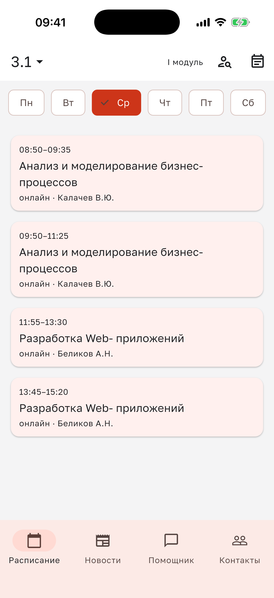
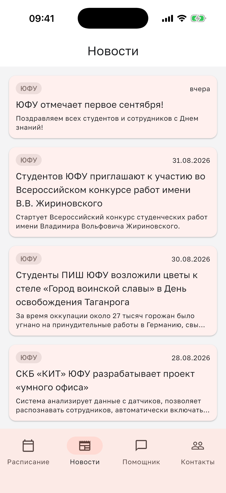
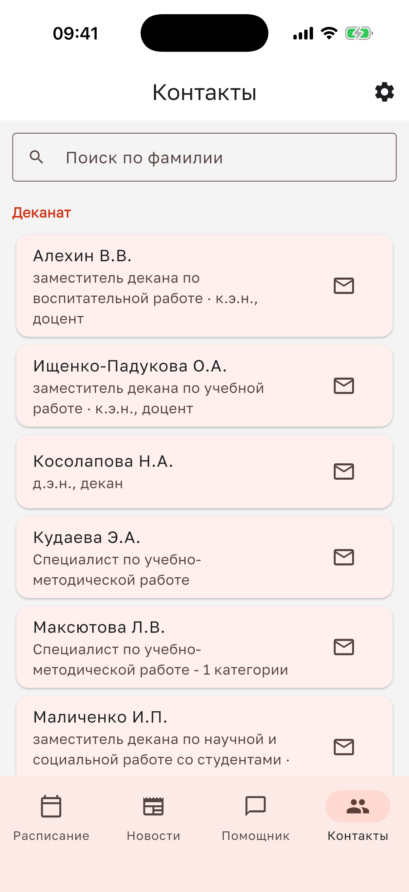
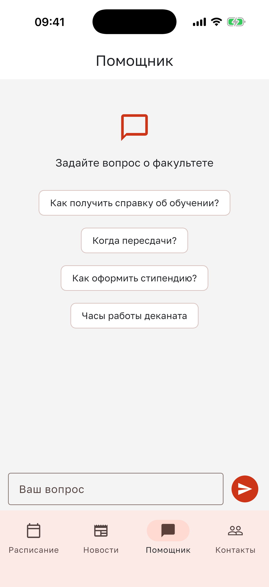

<h1 align="center">Эконом ЮФУ</h1>

<p align="center">
  <strong>Расписание, новости, контакты и учебный помощник в одном Flutter-приложении</strong><br>
  для студентов экономического факультета Южного федерального университета
</p>

<p align="center">
  <a href="https://github.com/0legRogovenko/sfedu-econ-app/actions/workflows/ci.yml"></a>
  <a href="https://github.com/0legRogovenko/sfedu-econ-app/actions/workflows/security.yml"></a>
  <a href="LICENSE"></a>
</p>

> [!IMPORTANT]
> **Неофициальный проект.** Приложение не связано с ЮФУ или его
> подразделениями и не выражает их позицию. Расписание, новости и контакты
> собираются из открытых источников `sfedu.ru` и `econ-sfedu.ru`; публикации
> могут обновляться с задержкой или содержать ошибки источника. В важных
> ситуациях сверяйтесь с официальными страницами и документами университета.

## Для студентов и фокус-группы

«Эконом ЮФУ» собирает повседневную информацию факультета в одном мобильном
интерфейсе. Можно быстро открыть расписание и сессию, прочитать новости, найти
контакт преподавателя или деканата и задать общий вопрос по учёбе.

Сейчас Android-версия проходит закрытое beta-тестирование. Участники
фокус-группы получают APK напрямую и помогают проверить установку, актуальность
данных и удобство основных сценариев на разных устройствах.

## Как выглядит приложение

<table>
  <tr>
    <td align="center" width="50%">
      <strong>Расписание</strong><br>
      
    </td>
    <td align="center" width="50%">
      <strong>Новости</strong><br>
      
    </td>
  </tr>
  <tr>
    <td align="center" width="50%">
      <strong>Контакты</strong><br>
      
    </td>
    <td align="center" width="50%">
      <strong>Помощник</strong><br>
      
    </td>
  </tr>
</table>

## Возможности

- **Расписание и сессия.** Выбор группы или преподавателя, верхняя и нижняя
  недели по календарю сервера, фильтр подгруппы, избранное и ближайшие экзамены
  с консультациями.
- **Работа без стабильной сети.** Последние полученные расписание, новости и
  контакты сохраняются в локальном кэше и остаются доступны офлайн.
- **Новости факультета.** Лента с постраничной загрузкой, подробным экраном и
  переходом к исходной публикации.
- **Контакты.** Поиск по деканату и кафедрам, почта по кнопке и переход к
  расписанию преподавателя.
- **Учебный помощник.** Ответы на общие организационные вопросы по локальной
  базе знаний. Ответ помощника может быть неполным или ошибочным и не заменяет
  информацию от деканата и преподавателей.

## Получить beta APK

Чтобы запросить актуальную Android-сборку и инструкцию установки, напишите на
[080806oleg@gmail.com](mailto:080806oleg@gmail.com). В письме достаточно указать
модель устройства и версию Android; пароли, документы и другие чувствительные
данные присылать не нужно.

APK передаётся участникам фокус-группы вручную после подтверждения доступности
сборки. Перед установкой сверьте имя файла и контрольную сумму из сообщения.
Сценарии проверки и форма обратной связи описаны в
[инструкции для beta-тестирования](BETA_TESTING.md).

## Архитектура

```text
Открытые страницы и документы ЮФУ
                 ↓ парсеры
        FastAPI + PostgreSQL
                 ↓ REST, ETag/304
       Flutter + локальный drift-кэш
```

- [`backend/`](backend/README.md) — Python 3.12, FastAPI, SQLAlchemy 2,
  Alembic, PostgreSQL 16, фоновые импортеры и API приложения.
- [`app/`](app/README.md) — Flutter-клиент на Riverpod, go_router, drift и
  dio для Android и iOS.
- AI-помощник вызывается через бэкенд; без настроенного Anthropic API он
  возвращает безопасный резервный ответ с контактами деканата.

## Запуск для разработчика

Для бэкенда нужны Docker и Docker Compose:

```bash
cd backend
cp .env.example .env
docker compose up -d --build
docker compose exec api python -m src.seed
```

API будет доступен на `http://localhost:8000`, PostgreSQL — на
`localhost:5433`. Перед общим или публичным запуском замените демонстрационные
значения секретов в локальном `.env`; сам файл не должен попадать в Git.

Для мобильного клиента нужен Flutter 3.44.6:

```bash
cd app
flutter pub get
flutter run
```

Android-эмулятор обращается к API хоста через отдельный адрес:

```bash
flutter run --dart-define=API_BASE_URL=http://10.0.2.2:8000
```

Подробные варианты локального запуска находятся в инструкциях
[бэкенда](backend/README.md) и [приложения](app/README.md).

## Проверки и безопасность

Основной CI запускается для push и pull request:

- бэкенд — `ruff check`, `ruff format --check` и `pytest`;
- схема — применение миграций и `alembic check` на PostgreSQL 16;
- приложение — форматирование отслеживаемых Dart-файлов, `flutter analyze` и
  `flutter test`.

Отдельный workflow безопасности запускается для pull request, push в `main`,
по недельному расписанию и вручную. Gitleaks работает как блокирующая проверка
внутри workflow: найденный секрет завершает его ошибкой. Semgrep и Trivy
работают в advisory-режиме с `continue-on-error`: они сохраняют отчёты, но их
находки сами по себе не делают workflow красным. Эти автоматические проверки
не заменяют аудит безопасности и не гарантируют отсутствие уязвимостей.
Динамическое сканирование пока не запускается, поскольку у проекта нет
стабильного staging-стенда.

## Приватность

Выбор группы, тема и избранное хранятся на устройстве. При использовании
помощника сервер обрабатывает случайный идентификатор устройства, текст вопроса,
ответ и время запроса; при настроенном Anthropic API вопрос передаётся этому
сервису. Не отправляйте помощнику персональные или конфиденциальные сведения.
Связанные с устройством логи можно удалить из настроек приложения.

Полное описание данных, сроков хранения и удаления приведено в
[политике конфиденциальности](PRIVACY.md).

## Лицензия

Исходный код распространяется по лицензии [GNU AGPL-3.0](LICENSE). Условия
использования, изменения и распространения определяются полным текстом
лицензии.

## Автор

**Олег Роговенко**

[080806oleg@gmail.com](mailto:080806oleg@gmail.com)
